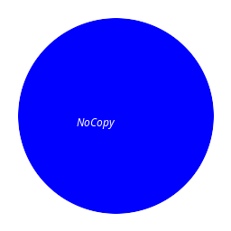

# NoCopy IDE

A specialized integrated development environment designed to prevent cheating during programming exams, tests, and assignments.



## Overview

NoCopy IDE is a secure coding environment that helps instructors maintain academic integrity by preventing students from copying and pasting code. It provides a clean, focused interface for writing, compiling, and running code in several programming languages.

## Key Features

- **Anti-Cheating Mechanisms**:
  - Disabled copy and paste functionality
  - No context menu in code editor
  - Prevention of keyboard shortcuts for copying/cutting/pasting
  - Workspace files are automatically deleted when the application is closed

- **Development Environment**:
  - Support for C, C++, Java, Python, and R programming languages
  - Built-in code templates for each supported language
  - Syntax highlighting
  - File explorer for workspace management
  - Console output panel with resize controls

- **Compilation and Execution**:
  - One-click compile and run functionality
  - Detailed compiler error messages
  - Program output in the console panel
  - Python interpreter integration
  - R script execution support

- **User Interface**:
  - Dark/light mode support
  - Adjustable font size
  - Resizable panels
  - File explorer navigation
  - Log panel for system messages

## System Requirements

- Java 11 or higher
- Operating systems: Windows, macOS, or Linux
- Compilers:
  - For C/C++: GCC or compatible compiler
  - For Java: JDK 11 or higher
  - For Python: Python 3.6+ interpreter
  - For R: R 4.0+ runtime

## Installation

1. Ensure you have Java 11+ installed on your system
2. Download the latest release from the releases page
3. Run the JAR file:
   ```
   java -jar nocopy-ide.jar
   ```

## Usage

### Creating a New File

1. Select your preferred language from the dropdown menu
2. Click "New" or use the keyboard shortcut
3. A new file with appropriate template will be created

### Compiling and Running Code

1. Write your code in the editor
2. Click "Compile & Run" or press F5
3. View the program output in the console panel

### Saving Files

- Click "Save" or use Ctrl+S to save the current file
- All files are saved to the secure workspace directory

## For Instructors

NoCopy IDE is designed to be used in controlled environments such as:

- Computer labs during programming tests
- Timed programming assignments
- Coding interviews

The application ensures students cannot easily copy code from external sources, helping to assess their true programming abilities.

## Building from Source

1. Clone the repository
2. Build using Maven:
   ```
   mvn clean package
   ```
3. Find the executable JAR in the `target` folder

## Contributing

Contributions are welcome! Please feel free to submit a Pull Request.

## License

This project is licensed under the MIT License - see the LICENSE file for details.

## Acknowledgements

- JavaFX for the user interface
- Maven for dependency management
- Various open-source libraries that made this project possible